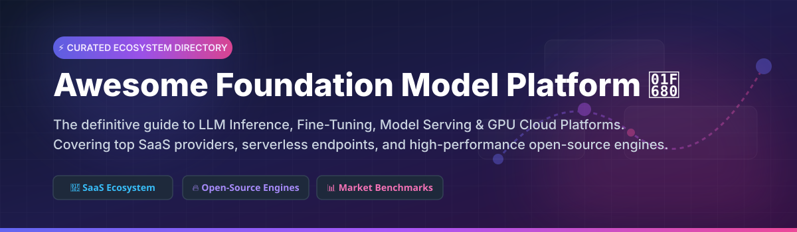

# Awesome Foundation Model Platform 🚀

  

  
  
  
  

## 🌟 Top Foundation Model Platforms & LLM Infrastructure Ecosystem

**A Curated List of Commercial SaaS Products & High-Performance Open-Source Projects**

*Optimized for LLM Inference, Fine-Tuning, Open-Weight Model Serving, Dedicated GPU Endpoints & Serverless APIs*

**Last updated: September 2026** 📅

---

Welcome to the ultimate directory of **Foundation Model Platforms**! ⚡ This repository tracks market-leading **SaaS platforms** and top-tier **open-source projects** enabling AI engineers, enterprise platform teams, and researchers to host, fine-tune, scale, and serve large language models (LLMs) and multimodal foundation models.

Whether you are looking for zero-ops serverless APIs like Together AI and Fireworks AI, managed lakehouse AI engines like Mosaic AI (Databricks), hardware-accelerated LPUs from Groq, or high-throughput self-hosted engines like vLLM and Ollama, this curated list covers the full spectrum.

---

## 📑 Table of Contents
- [📊 Market Landscape & Insights](#-market-landscape--insights)
- [☁️ SaaS & Managed Hosted Platforms](#%EF%B8%8F-saas--managed-hosted-platforms)
- [🔥 Open-Source GitHub Projects](#-open-source-github-projects)
- [🛠️ Deployment & Architecture Recommendations](#%EF%B8%8F-deployment--architecture-recommendations)
- [🤝 How to Contribute](#-how-to-contribute)
- [💖 Support & Sponsorship](#-support--sponsorship)
- [📈 Star History](#-star-history)
- [⚠️ Disclaimer](#%EF%B8%8F-disclaimer)

---

## 📊 Market Landscape & Insights

> **Market Size & Structure**: The global Foundation Model & LLM Inference Infrastructure market is estimated at **$12.5 Billion+** (2026) with a CAGR exceeding 35%. 
> 
> **Fragmentation**: The sector is **moderately fragmented**. While cloud hyperscalers and key hardware leaders hold solid market share, specialized serverless inference platforms (Together, Fireworks, Groq, Baseten) are capturing huge workloads by competing aggressively on token latency, cost per million tokens, and LoRA serving efficiency.

---

## ☁️ SaaS & Managed Hosted Platforms

The table below summarizes commercial foundation model platforms. Sorted by company size (estimated valuation/market capitalization descending):

| Platform / Product | Revenue / Valuation 💰 | Starting Pricing 🏷️ | Free Tier / Trial Limits 🎁 | Description 📝 |
| :--- | :--- | :--- | :--- | :--- |
| **[Mosaic AI (Databricks)](https://www.databricks.com/)** 🏢 | **$43B** Valuation *(Revenue > $2.4B)* | $0.07 / DBU (Databricks Units) | $415 free credits for 14-day trial | Databricks’ foundation model and generative AI platform for training, fine-tuning, and governed serving inside the enterprise lakehouse. |
| **[Anyscale](https://www.anyscale.com/)** ⚡ | **$1.0B** Valuation | $0.20 / cluster node hour | $50 free credits upon sign-up | Ray-powered scalable platform for AI compute, foundation model training, fine-tuning, and production model serving. |
| **[Together AI](https://www.together.ai/)** 🚀 | **$1.25B** Valuation | $0.18 / 1M tokens (Llama 3 8B) | $25 one-time free credit for new users | Comprehensive serverless & dedicated inference platform with fine-tuning pipelines and extensive open-weight model catalog. |
| **[GroqCloud](https://groq.com/)** ⏩ | **$2.8B** Valuation | $0.05 / 1M tokens (Llama 3 8B) | Free tier: 30 requests/min, 14,400 requests/day | Extremely high token throughput and ultra-low latency inference engine powered by custom Groq LPU hardware. |
| **[Fireworks AI](https://fireworks.ai/)** 🎆 | **$550M** Valuation | $0.20 / 1M tokens (Llama 3 8B) | $1 Sign-up credit (approx. 5M tokens) | High-performance inference platform optimized for compound AI systems, function calling, structured outputs, and JSON mode. |
| **[Baseten](https://www.baseten.co/)** 🛠️ | **$210M** Valuation | $0.0002 / GPU sec ($0.70/hr A10G) | $30 free credits for initial model deployments | Developer-focused deployment platform for serving custom models with fast cold starts, autoscaling endpoints, and custom runtimes. |
| **[Nebius AI](https://nebius.com/)** 🌐 | **$1.5B+** Market Cap (Parent) | $0.45 / GPU hour (NVIDIA H100) | $100 free trial credits for new cloud accounts | AI cloud infrastructure provider delivering dedicated GPU capacity and hosted model-serving endpoints. |
| **[OctoAI](https://octo.ai/)** *(Acquired by Databricks)* 🐙 | **$165M** Valuation (Prior) | $0.15 / 1M tokens | $10 free inference credits on registration | Efficient model serving and fine-tuning platform oriented toward cost-effective inference of open vision and text models. |
| **[Predibase](https://predibase.com/)** 🎯 | **$75M** Valuation | $0.20 / 1M tokens | $25 free compute credits upon account creation | Developer platform specialized in efficient fine-tuning and LoRA serving for open foundation models. |
| **[Lepton AI](https://www.lepton.ai/)** ⚛️ | **$50M** Valuation | $0.00022 / sec (Standard GPU instance) | $10 free credit upon registration | Pythonic developer platform for deploying AI models instantly with simple abstractions and serverless runner infrastructure. |

---

## 🔥 Open-Source GitHub Projects

Leading open-source engines and frameworks for serving, running, fine-tuning, and managing foundation models locally or on self-managed cloud infrastructure. Sorted by GitHub Stars_Count (descending):

| Open-Source Project 🐙 | GitHub_Stars ⭐ | Description 📝 |
| :--- | :--- | :--- |
| **[ollama / ollama](https://github.com/ollama/ollama)** 🦙 |  | Popular open-source tool for running and serving LLMs locally with simple CLI commands, Modelfiles, and an OpenAI-compatible API. |
| **[huggingface / transformers](https://github.com/huggingface/transformers)** 🤗 |  | State-of-the-art Machine Learning library for PyTorch, TensorFlow, and JAX providing APIs and tools to download and train open models. |
| **[ggerganov / llama.cpp](https://github.com/ggerganov/llama.cpp)** 🦙 |  | LLM inference in C/C++ with zero dependencies, quantization algorithms (GGUF), and hardware acceleration for CPU, Apple Silicon, and CUDA. |
| **[ray-project / ray](https://github.com/ray-project/ray)** ⚡ |  | Unified open-source framework for scaling AI and Python applications (Ray Serve powers scalable LLM deployment pipelines). |
| **[vllm-project / vllm](https://github.com/vllm-project/vllm)** 🚀 |  | High-throughput and memory-efficient LLM serving engine utilizing PagedAttention, continuous batching, chunked prefill, and tensor parallelism. |
| **[hiyouga / LLaMA-Factory](https://github.com/hiyouga/LLaMA-Factory)** 🏭 |  | Easy-to-use unified fine-tuning framework supporting 100+ LLMs with SFT, DPO, PPO, ORPO, and LoRA via a web UI / CLI. |
| **[mudler / LocalAI](https://github.com/mudler/LocalAI)** 🏡 |  | Open-source, drop-in OpenAI-compatible REST API alternative for local inference, supporting LLMs, audio, image generation, and embeddings. |
| **[sgl-project / sglang](https://github.com/sgl-project/sglang)** ⚡ |  | Fast serving framework for LLMs and vision-language models with structured output decoding, RadixAttention cache reuse, and high throughput. |
| **[bentoml / BentoML](https://github.com/bentoml/BentoML)** 🍱 |  | Open-source platform for building, packaging, shipping, and scaling enterprise AI applications and LLM endpoints. |
| **[huggingface / text-generation-inference (TGI)](https://github.com/huggingface/text-generation-inference)** 🤗 |  | Hugging Face's production-grade inference engine for deploying popular open transformer models with token streaming and spec decoding. |
| **[axolotl-ai-cloud / axolotl](https://github.com/axolotl-ai-cloud/axolotl)** 🦙 |  | Tool designed to simplify fine-tuning of various AI models, supporting various configurations and architectures like LoRA, QLoRA, and DeepSpeed. |
| **[kserve / kserve](https://github.com/kserve/kserve)** ☸️ |  | Standardized Cloud Native Model Serving platform built on Kubernetes, supporting vLLM, TGI, Triton, and serverless scale-to-zero capabilities. |
| **[triton-inference-server / server](https://github.com/triton-inference-server/server)** 🟢 |  | NVIDIA Triton Inference Server provides an optimized multi-framework inference solution across GPU and CPU hardware. |
| **[bentoml / OpenLLM](https://github.com/bentoml/OpenLLM)** 🔓 |  | Open platform for operating large language models (LLMs) in production; deploy and serve any open-source LLM with vLLM integration. |
| **[TensorRT-LLM (NVIDIA)](https://github.com/NVIDIA/TensorRT-LLM)** 🏎️ |  | NVIDIA’s open C++ and Python library for compiling and optimizing LLM inference for peak performance on NVIDIA GPUs. |

---

## 🛠️ Deployment & Architecture Recommendations

- 🚀 **High-Throughput Production Inference**: Self-host **vLLM** or **SGLang** on Kubernetes (via **KServe**) or bare metal GPUs for maximal throughput and lowest cost per request.
- 💻 **Local Prototyping & Private Edge**: Use **Ollama** or **LocalAI** for desktop development, internal CLI workflows, and air-gapped single-node deployments.
- ⚡ **Ultra-Low Latency Agentic Systems**: Leverage **GroqCloud** (LPU acceleration) or **Fireworks AI** (optimized function calling & structured outputs).
- 🧬 **Custom LoRA Fine-Tuning Pipelines**: Fine-tune with **LLaMA-Factory** or **Axolotl** → serve with **Predibase** or **vLLM** multi-LoRA adapters.
- 🏢 **Enterprise Lakehouse Integration**: Utilize **Mosaic AI (Databricks)** for unified governance, fine-tuning, and direct data lineage within your data warehouse.

---

## 🤝 How to Contribute

Contributions are warmly welcome! 💖 If you want to add a new SaaS platform or Open-Source engine, please follow these steps:

1. Fork the repository 🍴
2. Create a feature branch (`git checkout -b add-new-platform`)
3. Add/edit entries in `README.md` following the established table structure.
4. Submit a Pull Request (PR) with a brief description of the addition!

---

## 💖 Support & Sponsorship

If you find this repository helpful for your AI architecture decisions, please consider starring standard GitHub repos, sharing with fellow engineers, and supporting further maintenance! 🌟

Thank you for being part of the open AI community! 🙏

---

## 📈 Star History

---

## ⚠️ Disclaimer

- This is a **community-curated** repository intended for informational and comparative purposes — not an official endorsement.
- Foundation model platforms process user prompts and potentially sensitive business data. Ensure appropriate compliance (SOC2, HIPAA, GDPR), security policies, and access controls before deploying workloads.

---

  <b>Built for AI engineers, platform teams, and MLOps architects scaling foundation models globally. 🌐</b>

